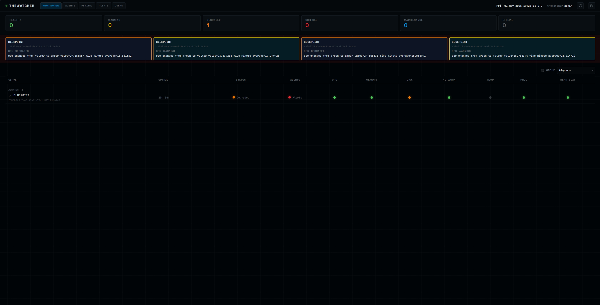
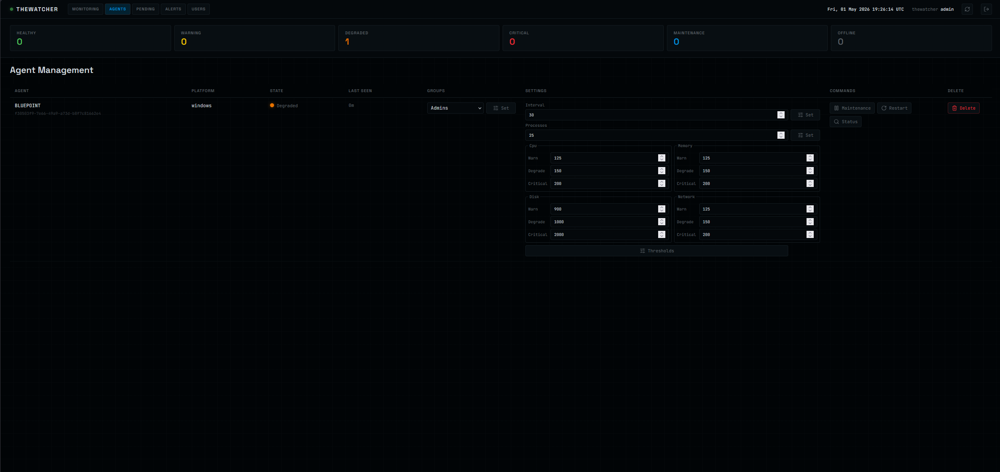
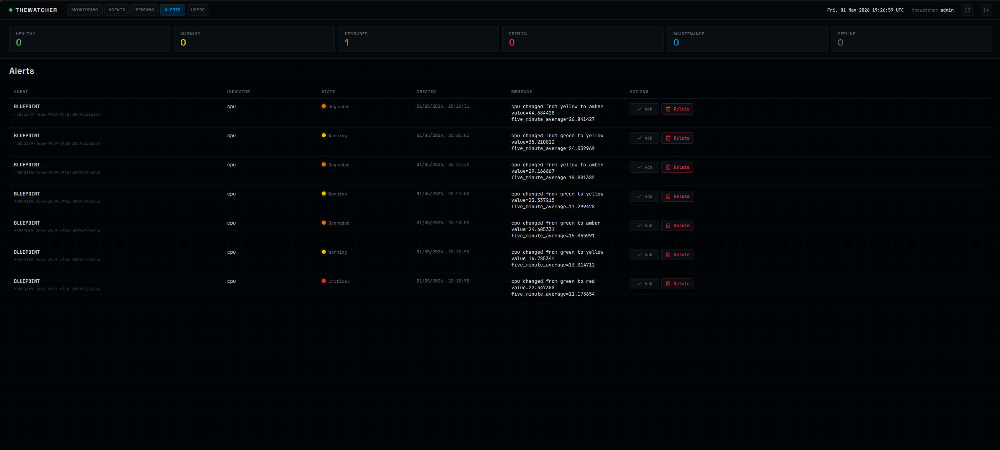

# TheWatcher

## Currently under active development.

TheWatcher is a platform agnostic server/endpoint monitoring platform trying to be better than the complex and ugly solutions that are currently out there.

It's been created in C++20 with deployable user-space
agents, a ZeroMQ/LibSodium data plane, a SQLite-backed server (PostgreSQL to come), and a React dashboard.

Agents initiate all network connections. They enroll with the server, submit
metrics periodically, send heartbeats, and request current runtime config after
each metrics submission. The server receives data, queues commands/config
responses over the existing agent connection, exposes the REST API, and marks
agents offline when `last_seen` exceeds the configured threshold.

## Quick Start

Build everything from a Visual Studio developer PowerShell prompt:

```powershell
.\scripts\setup-build-env.cmd -SkipWsl
.\meson-build.cmd
```

(On Linux: `./scripts/setup-build-env-linux.sh` then
`meson setup builddir-release --buildtype=release && meson test -C builddir-release --print-errorlogs`.
On BSD: `./scripts/setup-build-env-bsd.sh` and the same meson commands.)

Start the server in foreground mode:

```powershell
.\builddir-release\server\TheWatcherServer.exe --config C:\ProgramData\TheWatcher\server.json
```

Create or edit the agent config:

```text
THEWATCHER_SERVER=127.0.0.1
```

Start the agent in foreground mode:

```powershell
.\builddir-release\agent\TheWatcherAgent.exe --config C:\ProgramData\TheWatcher\TheWatcherAgent.conf
```

Run the dashboard during development:

```powershell
cd dashboard
npm.cmd install
npm.cmd run dev
```

Open `http://127.0.0.1:5173`, approve the pending agent on the Pending
Enrollments page, and wait for metrics to arrive. The approved enrollment
response gives the agent the server public key plus a pinned fingerprint, which
the agent writes back to `TheWatcherAgent.conf`.

## Documentation

- [Installation](docs/installation.md): build outputs, install locations,
  Windows service installation, non-Windows supervision.
- [Configuration](docs/configuration.md): every server and agent config option,
  default config paths, generated files, and command-line overrides.
- [Running](docs/running.md): foreground start/stop, service start/stop,
  dashboard startup, enrollment workflow, and health checks.
- [Architecture](docs/architecture.md): server, agent, common protocol,
  dashboard, storage, and command/config data flow.
- [Dashboard](docs/dashboard.md): UI behavior, API contract, and development
  commands.
- [Development](docs/development.md): repository layout, build/test targets,
  coding workflow, and how to extend the product end to end.
- [Collector Contract](docs/collector-contract.md): how collectors populate
  `SystemMetrics` and what to change when adding a collector.
- [Build Environment](docs/build-environment.md): Windows, Linux, and BSD
  toolchain setup for the Meson build.
- [Logging](docs/logging.md): log file locations and startup diagnostics.
- [Service Installation](docs/service-installation.md): focused Windows service
  command reference.

## Main Targets

```powershell
meson compile -C builddir-release TheWatcherServer TheWatcherAgent
meson test    -C builddir-release config_test store_test
meson test    -C builddir-release server_agent_integration_test
```

The dashboard is built with npm:

```powershell
cd dashboard
npm.cmd run build
npm.cmd test
```
## Screenshots





